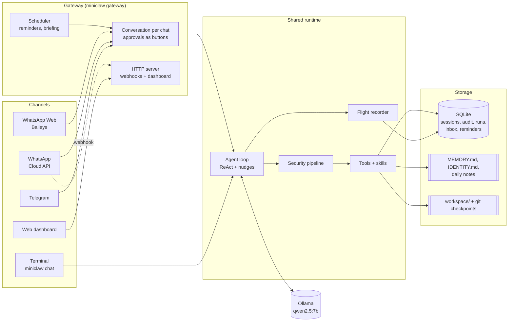
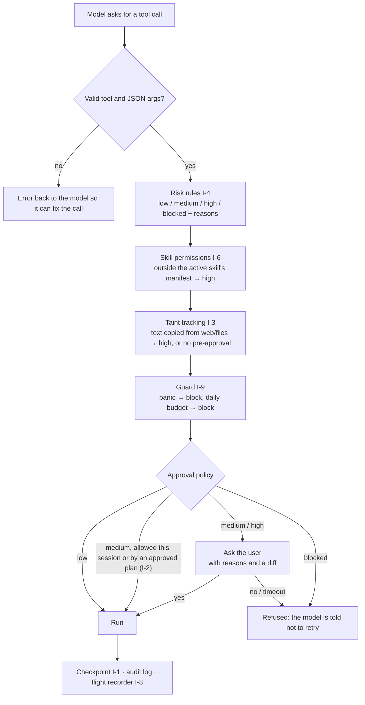

# 🦀 MiniClaw

A minimal, self-hosted, security-first personal AI agent inspired by [OpenClaw](https://github.com/openclaw/openclaw).
Runs fully on your machine with a local model through [Ollama](https://ollama.com). It can read and write files,
run shell commands and fetch web pages, but only inside a sandboxed workspace, with explainable approvals
and an undo button.

> Final Year Project. See [roadmap.md](roadmap.md) for the full plan, design and timeline.

## Status

| Phase | Status |
|---|---|
| 1. CLI + LLM (chat, streaming, doctor) | ✅ Done |
| 2. Agent loop + tools, undo (I-1), plan preview (I-2), risk scoring (I-4) | ✅ Done |
| 3. Persistence & memory, memory inbox (I-5) | ✅ Done |
| 4. Skills, permission manifests (I-6), verified actions | ✅ Done |
| 5. Gateway: Telegram + WhatsApp (official & unofficial), reminders, daily briefing, panic button (I-9) | ✅ Done |
| 6. Web dashboard, flight recorder and replay (I-8) | ✅ Done |
| 7. Taint tracking (I-3), evaluation, 97% test coverage | ✅ Done — **v1.0.0** |
| 8. Report & viva | ⏳ Next |

## Results

Full details: [`eval/RESULTS.md`](eval/RESULTS.md).

**Prompt injection (I-3).** The test set is 20 attacks hidden in web pages and files. The worst case is a model
that falls for every attack:

| | Taint tracking off | Taint tracking on |
|---|---|---|
| Attacks executed (cautious user) | 18/20 (90%) | **3/20 (15%)** (only the 3 paraphrased attacks) |
| Attacks executed (fatigued user) | 18/20 (90%) | 8/20 (40%) |
| Live qwen2.5:7b, attacks executed | 1/20 | **0/20** |

**Everyday tasks.** The benchmark has 30 tasks and was run twice on each model:

| | qwen2.5:7b | llama3.1:8b |
|---|---|---|
| Success | 73% | 77% |
| Valid tool calls | 100% | 98% |
| Time per task | 11.4 s | 18.2 s |

Reproduce with `bun run eval:injection [--live]` and `bun run eval:tasks [-m model] [-n runs]`.

## Architecture



Every tool call the model makes goes through the same pipeline, in this order:



## Quick start

Requirements: [Bun](https://bun.sh) ≥ 1.1, [pnpm](https://pnpm.io), [Ollama](https://ollama.com), git.

```bash
pnpm install
ollama pull qwen2.5:7b      # default model (supports tool calling)
cp .env.example .env        # optional: change model / provider
bun run doctor              # check everything is set up
bun run chat                # start chatting
```

Use another model for one session: `bun src/index.ts chat --model llama3.1:8b`

## What it can do

```
you › Read notes.txt and save a 2-bullet summary to summary.md
  ⚙ read notes.txt [low]
    ✔ done
  ⚙ write summary.md [medium]
    • creates summary.md
    • can be reverted with /undo
      @@ -0,0 +1,2 @@
      +- MiniClaw is a local AI agent.
      +- It can undo changes.
    Allow? [yes / no / always allow summary.md this session] y
    ✔ done · changed +summary.md
miniclaw › I created summary.md with two key points from notes.txt.
```

| Tool | What it does | Usual risk |
|---|---|---|
| `read_file` | Read a text file in the workspace | low (auto) |
| `list_dir` | List a workspace folder | low (auto) |
| `write_file` | Create, overwrite or append to a file (shows a diff) | medium |
| `run_shell` | Run a shell command in the workspace | medium – blocked |
| `web_fetch` | Download a web page as text; for JSON APIs, return only chosen `fields` | medium – high |
| `remember` | Propose a fact about you for long-term memory (you confirm it) | low |
| `recall_notes` | Read the daily log of a given day | low |
| `set_reminder`, `list_reminders`, `cancel_reminder` | Reminders, one-off or daily/weekly | low |
| *each skill* | Returns the skill's instructions (asks for consent on first use) | high once, then low |

### Chat commands

| Command | Description |
|---|---|
| `/plan <task>` | Show the agent's plan with a risk level per step, approve it once, then run it |
| `/memory` | Show what MiniClaw remembers about you |
| `/inbox` | Review memories the agent proposed |
| `/forget <words>` | Delete remembered facts containing these words |
| `/notes [date]` | Show the daily log (`today`, `yesterday` or `YYYY-MM-DD`) |
| `/undo [n]` | Undo the last *n* file changes made by the agent |
| `/history` | List agent changes that can be undone |
| `/skills` | List installed skills, their permissions and consent status |
| `/reminders [cancel <n>]` | Upcoming reminders (delivered by the gateway) |
| `/status` | Pause state and today's action budgets |
| `/panic`, `/resume` | Emergency stop for risky actions, and lifting it |
| `/tools` | List available tools |
| `/new` | New conversation (also forgets "always allow" approvals). Otherwise the last conversation continues after a restart. |
| `/help`, `/exit` | Help, quit (or Ctrl+D) |

Press **Ctrl+C** while the agent is working (or at an approval prompt) to stop it.

## Memory

```
you › I'm vegetarian and I'm in Goa this week.
  ⚙ remember "User is vegetarian." [low]
  ⚙ remember "User is in Goa this week." [low]
📥 Remember this? User is vegetarian.        [yes / no / later] y
   ✔ saved to memory
```

- **Conversations** are saved in SQLite (`data/miniclaw.db`) and continue after a restart.
- **Long-term facts** live in `data/memory/MEMORY.md`, a Markdown file you can read and edit. Facts can expire.
- **Memory inbox (I-5):** the agent can only *propose* memories; nothing is saved until you say yes.
  If a proposal comes after the agent read a web page or file, you get a ⚠ prompt-injection warning naming the source.
- **Persona:** edit `data/memory/IDENTITY.md` to change MiniClaw's personality and rules.
- **Daily notes:** `data/memory/notes/YYYY-MM-DD.md` logs each request and the actions taken.

## Chat apps (`miniclaw gateway`)

Run `bun run gateway` to reach MiniClaw from your phone. Each chat has its own conversation.
Approvals arrive as buttons (or numbered questions), unanswered questions count as "no" after 10 minutes,
and reminders are delivered to the chat they were set in. Only allowlisted people get answers;
everyone else is ignored silently.

| | Telegram | WhatsApp Cloud API (official) | WhatsApp Web via Baileys (unofficial) |
|---|---|---|---|
| Setup | 5 min, two bots in Telegram | ~20 min, Meta developer account | 2 min, scan a QR code |
| Public URL needed | No (long polling) | Yes, a webhook (ngrok) | No |
| Approval buttons | Inline buttons | Reply buttons (max 3) | Numbered replies |
| Allowed by the app's terms | Yes | Yes | **No**: the number can be banned |
| Messaging you first (reminders, briefing) | Any time | Only within 24 h of your last message (else needs templates) | Any time |
| Webhook security | n/a | Every request's HMAC signature is verified | n/a |

### Telegram

1. In Telegram, message **@BotFather**, send `/newbot`, follow the steps and copy the **token**.
2. Message **@userinfobot**; it replies with your numeric **Id**.
3. In `.env`: `TELEGRAM_BOT_TOKEN=<token>` and `TELEGRAM_ALLOWED_USERS=<your id>`.
4. `bun run doctor`, then `bun run gateway`, and send your bot a message.

### WhatsApp: official Cloud API

1. On [developers.facebook.com](https://developers.facebook.com), create an app of type **Business** and add the **WhatsApp** product.
2. In **WhatsApp > API Setup**:
   - copy the temporary **access token** (it lasts 24 h) and the **Phone number ID**;
   - add your own phone under the "To" numbers and verify it with the code WhatsApp sends.
3. In **App settings > Basic**, copy the **App secret**.
4. In `.env`, set:
   - `WHATSAPP_TOKEN`, `WHATSAPP_PHONE_NUMBER_ID` and `WHATSAPP_APP_SECRET`,
   - `WHATSAPP_VERIFY_TOKEN` (any string you choose),
   - `WHATSAPP_ALLOWED_NUMBERS=<your number with country code, e.g. 919876543210>`.
5. Start `bun run gateway`, then in a second terminal run `ngrok http 8787` and copy its `https://…` URL.
6. In **WhatsApp > Configuration > Webhook**, set:
   - **Callback URL** to `https://<ngrok-url>/webhooks/whatsapp`,
   - **Verify token** to the same value as `WHATSAPP_VERIFY_TOKEN`.

   Click **Verify and save**, then subscribe to the **messages** field.
7. Send a WhatsApp message to the test number.

The free ngrok URL changes on every restart (update the callback URL). For longer than 24 hours, create a
permanent token with a System User in Meta Business Settings.

**Keeping your number safe:**
- Only add your number under **"To"** (a recipient).
- Skip **Step 2 "Register your WhatsApp phone number"**: it would move that number off the normal WhatsApp app.
- Skip business verification and "Become a Tech Provider"; neither is needed for the test number.

**Troubleshooting:**
- **Where the webhook settings are:** in Meta's newer layout they're under **WhatsApp use case → Step 2. Production
  setup → Configure Webhooks**. Do only the webhook part on that page.
- **The webhook verifies but your messages never arrive** (no `POST` in ngrok's log at `http://127.0.0.1:4040`):
  the app isn't subscribed to the WhatsApp Business account. Fix it once with:
  ```bash
  curl -X POST -H "Authorization: Bearer $WHATSAPP_TOKEN" \
    https://graph.facebook.com/v26.0/<WHATSAPP_BUSINESS_ACCOUNT_ID>/subscribed_apps
  ```
  Also make sure the **messages** webhook field is subscribed.
- **Old Graph API versions get switched off.** MiniClaw uses v26.0; change `channels.whatsapp.apiBase` when Meta retires it.

### WhatsApp: unofficial (Baileys)

> ⚠️ This links MiniClaw like WhatsApp Web. It breaks WhatsApp's terms of service and the number can be
> banned. **Use a spare number**, not your main one.

1. In `.env`: `WHATSAPP_WEB_ENABLED=true` and `WHATSAPP_WEB_ALLOWED_NUMBERS=<numbers allowed to talk to it>`.
2. `bun run gateway` prints a QR code. On the phone with the number you want to link, open
   **WhatsApp > Settings > Linked devices > Link a device** and scan it.
3. Use it in one of two ways:
   - **Spare number linked:** message it from your main phone (allowlist your main number).
   - **Your own number linked:** use the **"Message yourself"** chat (allowlist your own number). MiniClaw only
     answers that chat, never your conversations with other people. Its replies start with 🦀.

The session is saved in `data/whatsapp-auth/`. Treat it like a password, and delete it to unlink.

### In chat

Send a normal message to talk. Commands: `/help`, `/new`, `/stop`, `/undo [n]`, `/history`, `/memory`, `/inbox`,
`/forget <words>`, `/reminders [cancel <n>]`, `/skills`, `/status`, `/panic`, `/resume`.

- **Reminders:** "remind me to call mom at 18:00" or "every day at 08:00 remind me to stretch".
- **Daily briefing:** set `"gateway": { "briefingTime": "08:00" }` in `miniclaw.config.json` and MiniClaw messages you
  first each morning with today's reminders and a recap of yesterday.
- **Panic button (I-9):** `/panic` from any chat stops all running work and blocks risky actions until `/resume`.
  This also works from the terminal. Daily budgets cap risky tools (defaults: 30 shell commands, 60 web fetches and
  60 file writes per day; change them with `agent.budgets`).

## Dashboard

`bun run gateway` prints a login link such as `📊 Dashboard: http://127.0.0.1:8787/?token=…`. Without chat apps,
use `bun run dashboard`.

| Page | What you can do |
|---|---|
| Overview | Pause state, today's action budgets, counts, recent runs; **Panic / Resume** in the top bar |
| Approvals | Answer approval questions waiting in any chat from your laptop (needs the gateway) |
| Flight recorder | Every agent run as a step-by-step timeline: model steps, tool calls with risk, verdict, arguments and results |
| Conversations | Every chat (terminal, Telegram, WhatsApp) as a transcript |
| Memory | Review proposed memories, forget facts, edit `MEMORY.md` and `IDENTITY.md` |
| Skills, Reminders, Audit log | Permissions and consent, upcoming reminders, every tool call |

**Security:**
- **Localhost only:** requests for any other host are refused, so the dashboard also can't be reached through the ngrok tunnel.
- **Login:** the link's secret token becomes an HttpOnly, SameSite=Strict cookie, and the token is removed from the URL.
- **Writes:** every change needs a custom header that other websites can't send (CSRF protection).
- **Untrusted text:** the page is built with DOM methods only, never `innerHTML`, under a strict Content Security Policy.

## Flight recorder & replay (I-8)

Every agent run is recorded in SQLite. It stores the starting context, every model step (text, tool calls,
estimated tokens, time), every tool call and any nudges MiniClaw added.

```bash
bun src/index.ts runs                                   # recent runs
bun src/index.ts replay <run-id> --model llama3.1:8b    # same situation, another model
bun src/index.ts replay <run-id> --times 5              # how consistent is the model?
```

**Replay never executes tools.** When the model makes a call the recording also made (same arguments, or the same
target such as the same file path), it gets the recorded result. Any other call ends the replay as *diverged*.
Possible outcomes: `matched`, `matched_targets`, `fewer_calls`, `diverged`, `step_limit`. This is the
evaluation harness for comparing models.

```
5 replays with qwen2.5:7b (avg 8.3s):
  fewer_calls        4  80%
  diverged           1  20%
```

## Skills

A skill is a folder with a `SKILL.md`: instructions for a task plus the permissions it needs. Drop a folder into
`skills/` and restart. No code changes are needed. Included: `weather` (wttr.in), `github-summary` (GitHub API),
`daily-journal` (files in the workspace) and `wikipedia` (topic summaries).

```markdown
---
name: weather
description: Current weather and a 3-day forecast for any city, from wttr.in.
permissions:
  - net:wttr.in
---
# Weather
1. For the current weather, call web_fetch with https://wttr.in/<City>?format=...
```

| Permission | Allows |
|---|---|
| `fs:read` / `fs:write` | read / change files in the workspace |
| `net:<host>` | fetch from that host (`*.example.com` for subdomains, `*` for any) |
| `shell:<program>` | run simple commands with that program (`*` for any command) |
| `memory` | propose memories, read daily notes |

**Permission manifests (I-6):**
- The first time a skill is used, you approve its permissions, like installing an app.
- If its `SKILL.md` changes later, you're asked again.
- While a skill is active, anything outside its permissions is raised to high risk and always asks.

Commands: `miniclaw skills` (list), `miniclaw skills revoke <name>` (ask again next time).

## Safety model

- **Sandbox:** file tools only work inside `workspace/`. Path traversal, symlink escapes and `.git` are refused.
- **Risk scoring (I-4):** every call is rated by fixed rules, not by the model, so a prompt injection can't argue its way past them.
  - `low` runs automatically.
  - `medium` asks, and you can allow it for the rest of the session.
  - `high` always asks and says why (e.g. *"deletes files"*, *"uses the network"*).
  - `blocked` never runs (e.g. `sudo`, `rm -rf ~`, `curl … | sh`).
- **Undo (I-1):** every change the agent makes to the workspace is a git checkpoint stored in `data/checkpoints.git`,
  outside the workspace, so the agent can't tamper with it.
- **Plan preview (I-2):** approve a whole multi-step task once. Only its medium-risk steps are pre-approved.
- **Untrusted content:** file and web content is wrapped in `<untrusted>` tags that can't be escaped, and the model is told never to follow instructions inside them.
- **Taint tracking (I-3):** a tool call that reuses text from a web page or file is flagged.
  - In a command, URL or path, the call becomes high risk with a "possible prompt injection" warning naming the source.
  - In content (a file's text, a reminder's text), "always allow" and plan approval stop applying, so you always see the call.
- **No secrets to tools:** shell commands get a minimal environment (no API keys); `web_fetch` re-checks every redirect (no SSRF to `localhost`).
- **Verified actions:** if the model claims "Added to your journal" but never called a tool, you see a warning,
  and the model is asked once to actually do it. Small models do this surprisingly often.
- **Audit log:** every tool call is recorded in SQLite (`audit_log`), with secrets redacted.

## Configuration

> **Context window:** Ollama often runs models with a 4096-token window and silently drops anything longer.
> MiniClaw fits everything into `agent.contextTokens` (default 4096). For longer conversations, start Ollama
> with `OLLAMA_CONTEXT_LENGTH=8192` and set `contextTokens` to 8192. `bun run doctor` checks that they match.


Settings are read in this order (later ones win): defaults → `miniclaw.config.json` → `.env` → CLI flags.

| Env var | Default | Description |
|---|---|---|
| `LLM_BASE_URL` | `http://localhost:11434/v1` | Any OpenAI-compatible API (Ollama, OpenAI, Groq, OpenRouter) |
| `LLM_MODEL` | `qwen2.5:7b` | Model name |
| `OPENAI_API_KEY` | – | Only needed for cloud providers |

Example `miniclaw.config.json`:

```json
{
  "llm": { "model": "qwen2.5:7b", "temperature": 0.5 },
  "agent": { "name": "MiniClaw", "maxSteps": 8, "contextTokens": 4096, "replyTokens": 768 },
  "paths": { "workspace": "workspace", "data": "data" }
}
```

## Development

```bash
bun test               # 221 unit + integration tests (the agent loop is tested with a scripted fake LLM)
bun run typecheck      # TypeScript type check
bun run coverage       # line coverage (97%)
bun run eval:injection # prompt-injection evaluation (add --live for the real model)
bun run eval:tasks     # 30-task benchmark (-m <model>, -n <runs>)
```

```
src/
├── index.ts               # CLI entry (commander): chat, doctor
├── config.ts              # config loading + validation (zod)
├── doctor.ts              # setup checks
├── agent/
│   ├── agent.ts           # agent loop: LLM ⇄ tools, approvals, checkpoints, audit, notes
│   ├── planner.ts         # /plan: structured, risk-scored plans (I-2)
│   ├── prompt.ts          # system prompt: identity + memory + tool rules
│   ├── session.ts         # conversation as whole turns, fitted to the token budget
│   └── tokens.ts          # token estimates
├── channels/              # cli.ts (terminal), telegram.ts, whatsappCloud.ts, whatsappWeb.ts
├── gateway/               # Gateway (routing, reminders, briefing), Conversation (per chat), channel config
├── scheduler/             # reminders store and scheduler
├── runtime.ts             # shared wiring for the CLI and the gateway
├── dashboard/             # dashboard API (server.ts) and UI (public/)
├── recorder/              # flight recorder (runs.ts) and replay (replay.ts)
├── db/                    # SQLite: migrations, session store
├── memory/                # MEMORY.md facts, inbox (I-5), IDENTITY.md, daily notes
├── llm/                   # provider interface + OpenAI-compatible client (streaming tool calls)
├── skills/                # SKILL.md loader, permission manifests (I-6), consent grants
├── security/
│   ├── sandbox.ts         # workspace path checks
│   ├── risk.ts            # rule-based risk scoring (I-4)
│   ├── approvals.ts       # approval policy (auto / session / plan / ask / block)
│   └── audit.ts           # JSONL audit log with secret redaction
├── tools/                 # read_file, list_dir, write_file, run_shell, web_fetch, remember, recall_notes, skill tools
└── workspace/checkpoints.ts  # git-backed undo (I-1)
```
